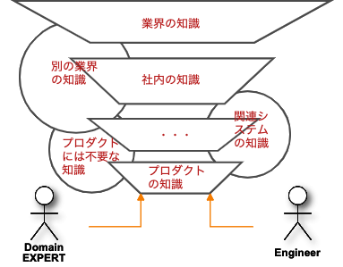

先日[こちらの記事](https://pilgrim-lifestyle.jp/blog/010_%E5%AE%89%E5%AE%9A%E3%81%97%E3%81%9F%E3%83%95%E3%82%A7%E3%83%BC%E3%82%BA%E3%81%AB%E5%85%A5%E3%81%A3%E3%81%A6%E3%81%93%E3%81%9D%E3%83%A2%E3%83%87%E3%83%AB%E3%82%92%E5%A4%89%E6%9B%B4%E3%81%97%E3%82%88%E3%81%86/)にて、安定したフェーズに入ったからこそモデルを変更していこうということを書いたのですが、
ここで改めて、 **「モデルとはなにか？」** というテーマについて考えたいと思いました。

特に、 **安定したフェーズに入ったプロダクトにとってモデルがどう役に立つのか** を再考したいと思います。

## モデルの名前を熟考するのは可読性や保守性のためだけではない

そもそもモデルとはなにか。

ドメイン駆動設計のエヴァンス本には

> モデルとは、蒸留された知識である (エヴァンス本第一部序章)

とあります。

蒸留という言葉が難しいですが、

プロダクトに関して、さらには業界について、会社について、別の業界や競合、社会、関連システムについてなど、
多くの議論をドメインエキスパートと重ねた結果、最終的に残ったプロダクトに必要な知識がモデルとして表現される。
そして、

> モデルは、チームメンバ全員が使用する言語の基盤である(エヴァンス本第一部序章)

である以上、ソースコードの可読性や保守性のためだけでなく、プロダクトのための知識そのものがモデルということです。

## 新加入メンバーへの共有にはまずドキュメント？

安定したフェーズにプロダクトが入ると多くの組織がメンバーの変更を行うことになると思います。
新しいメンバーが入ってプロダクトの共有をするとき、まずどうしていますか？

とりあえず、溜めてたドキュメントを読んでもらっていませんか？
そもそもドキュメントを用意していないチームもありますね。そのときはとりあえずソースを読んでもらう感じですかね。

モデルをきちんと維持できていれば、 **まずはモデルを見てもらう** ことで共有ができるはず。
なぜなら、

> モデルとは、蒸留された知識である (第一部序章)

からですね。

実際、エヴァンスも

> 異動・アウトソーシング・典型的な設計アプローチによる口頭での伝承の途切れによる知識の流出を防止する(エヴァンス本第一部 第一章)

と言っています。

また、そもそもモデルがきちんとされていればドキュメントも減るはず。

> すでにコードがうまくやていることを、ドキュメントでもやろうとしない(エヴァンス本第一部 第二章)

## いつの間にかぎこちない言葉で会話してませんか？

> モデルは、チームメンバ全員が使用する言語の基盤である(エヴァンス本第一部序章)

モデルの名前に違和感があっても、それを無理やり使っているということがあります。

[前回書いた](https://pilgrim-lifestyle.jp/blog/010_%E5%AE%89%E5%AE%9A%E3%81%97%E3%81%9F%E3%83%95%E3%82%A7%E3%83%BC%E3%82%BA%E3%81%AB%E5%85%A5%E3%81%A3%E3%81%A6%E3%81%93%E3%81%9D%E3%83%A2%E3%83%87%E3%83%AB%E3%82%92%E5%A4%89%E6%9B%B4%E3%81%97%E3%82%88%E3%81%86/)とおり、実装時は背景を知っているがために違和感に気が付かなったり、外部連携先と同じ名前使ってたり、議論不足だったり、概念が増えすぎて見えづらくなってたり、原因は様々ですが、新規で作ってるより、安定フェーズに入ってから実装されたものの方が名前に気を使わなくなる気がしています。

その名前をユビキタス言語だからと無理やり使っていると、無意識のうちに脳内で通訳、変換して用語を使うことになります。

> 通訳はコミュニケーションを鈍らせ、知識の噛み砕きを沈滞させる。しかも、これらの方言はどれも共通語になれない。(エヴァンス本第一部 第二章)

それはユビキタス言語ではありません。

コミュニケーションが鈍れば、スピードも落ち、いずれ変化に追いつかなくなるでしょう。

## 安定したフェーズに入っても、モデルについてきちんと考えているチームこそがビジネスをさらに発展させることができるはず

というわけで、安定したフェーズに入ったからこそ、モデルにもっと気を使い、簡単にレビューを通すのではなく、もっと議論してユビキタス言語を増やす努力をすることが、そのプロダクトをよいスピードを持って発展させられるのではないでしょうか？

> ソフトウェアの利用者を取り巻く世界が常に凝り固まったものとは限りません。人の営みは移ろいやすく、ときの流れとともに変化します。・・・そんなときドメインオブジェクトがドメインモデルを忠実に実現していればドメインの変化をコードに伝えることはたやすいです。（ドメイン駆動設計入門　1.2.2より）

まさに！！

## マイクロサービスの発展によってさらにやりやすく

最近のマイクロサービス化の流れはドメイン駆動設計を実践していくうえでいい流れだと思います。

何よりコンテキストを狭くすることで、モデルの範囲も考えなくてはいけない範囲も少なくて済むからです。

なにより、モノリシックなシステムをマイクロサービス化していこうとなれば、既存のシステムのモデルをカイゼンするチャンスです。

## モデルを維持するコツはひとつ！

> 不完全な場合、誤ってると思われる場合は懸念を表明する。(エヴァンス本第一部 第二章)

安定したフェーズでメンバーが変わっていくなかでもこれをチームの文化として維持していくこと。
多分意識しないとできないと思います。

可読性や保守性のアップ以上の効果があるのだから、ここを疎かにするのは非常にもったいないと思うのです。
という自分への戒めを最後にこの記事を締めたいと思います。