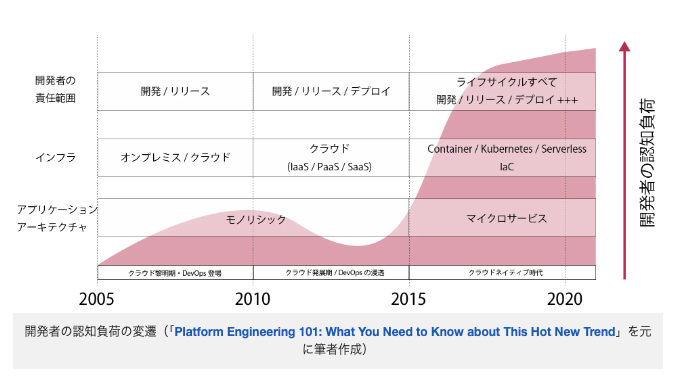
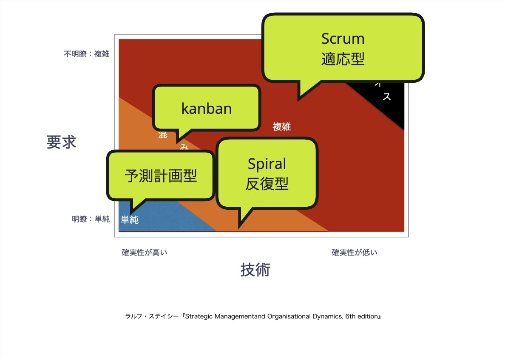

[アジャイルソフトウェア開発宣言](https://agilemanifesto.org/iso/ja/manifesto.html)から既に20年以上が経過し世はすっかりアジャイルの時代。。。と思いきや未だにウォーターフォールが適していないプロジェクトなのにウォーターフォールまっしぐらのチームが多くあることでしょう。

いまさらかもしれないですが、そんなしなくてもいい苦労をしているチームに向けて「なぜアジャイルなのか？」ということと「アジャイルとは何か？」ということについていくつかの記事にわけてまとめてみるシリーズ2回目です。

- 第一回： 

# ソフトウェアを作成することは要求・要件を決めて、それを作る作業

[前回](/blog/013_なぜアジャイルなのか)、そもそもソフトウェアとは**要求・要件を整理して、設計して、実装してテストしてリリースする**ものなので、ウォーターフォールはすごく最適化されたやり方だとお伝えしました。

ではなぜウォーターフォールではなく、アジャイルなのか？

それは、**要求・要件も実装も複雑化しているから**　です。

# 要求・要件が複雑化している

かつて、ソフトウェアを作るのには、メモリやCPUに制限があるなかで、メモリ管理をプログラムで制御しながら実装していく必要がありました。テストも自動化できず、手動で行っていました。開発環境も共有でアプリケーションサーバーなんかにデプロイしてからテストをする必要がありました。開発環境と本番環境を同じ構成にすることも難しく、リリース後に不具合が出ることもしばしば・・・ソフトウェアの配布なんかもフロッピーやCDでやっていたものです。

それが現在ではどうでしょう。メモリやCPUの制限について考える必要はかなり減りました。メモリ管理はプログラム言語に含まれ、テストの自動化もCIも簡単になりました。ローカル環境である程度本番同等の構成にすることも難しくなくなりました。なんなら今なら生成AIがコードを書いてくれる時代です。

ソフトウェアを作るのは簡単になりました。

しかし、その影響でソフトウェアに求める要求は複雑化しました。かつては基幹システムだったり業務用アプリなどに限られていたソフトウェアの領域は無限とも言えるぐらいに広がりました。今ソフトウェアを所有していない企業は存在しないでしょう。BtoBだけでなくBtoCにも分野は広がりソフトウェアが事業の中心である企業も少なくありません。個人でもPC、スマホのアプリを利用するのが普通で、いまや車や家電なんかにもソフトウェアが存在している時代です。

結果、ソフトウェアが簡単になる速度より適用分野が広がるのが速くなっていて、要求・要件が複雑化しているのが現代です。ソフトウェアでほぼなんでもできる。できるから要求・要件はシンプルにはなり得ないということです。

ビジネス面でも考えてみましょう。ブルーオーシャンに敢えて突っ込んでいくなら差別化する必要があり、レッドオーシャンを狙っていくなら当然この世にまだ存在しない要件を作り上げる必要があります。このあたりをソフトウェアで解決していこうと思えば複雑になっていくのは当然と言えるでしょう。

開発初期に要求・要件をすべて洗い出すのは大変困難であるのは上記の点が背景にあったりします。

このあたりは[エンジニアリング組織論への招待](https://www.amazon.co.jp/dp/B079TLW41L/)の著者広木さんが2023年の開発生産性Conferenceに登壇された際の資料がわかりやすかったので紹介しておきます。（テーマは開発生産性というテーマですが、その中で上記のようなことが言及されています。）

https://speakerdeck.com/hirokidaichi/da-gui-mo-yan-yu-moderushi-dai-nokai-fa-sheng-chan-xing?slide=11

ここでの結論としては、**複雑化した要求・要件に合わせた作り方** を考える必要が生じるのは当然だと思いませんか？ということです。

## 実装技術が複雑化している

ソフトウェアを作るのは簡単になりました。一方で実装技術やアーキテクチャは複雑化しています。メモリやCPUが豊富に使えるようになったため、多くの技術やアーキテクチャが生まれています。

例を上げるだけでも
- iOS/androidなどのスマホアプリ
- AWSやAzuruなどのクラウド
- マイクロサービス
- CQRS
- イベントソーシング
- CI/CD/DevOps
- etc

それぞれに専門家が必要なぐらい技術領域も広がっています。

以下の図は[プラットフォームづくりを成功に導く！開発者のための「Platform Engineering」入門](https://codezine.jp/article/detail/18752)で紹介されていた図になります

[AWS Summit Japan Day1のライブステージ](https://www.youtube.com/watch?v=aLTPYX58Zms&t=710s)でも紹介されていましたが、以前は盛んにフルスタックエンジニアが叫ばれていたのはどこにいったのか？というぐらいそれぞれの分野の専門性の要求が高まっているのが現実です。

であれば、やはり**複雑化した技術に合わせた作り方** も考える必要が生じるのは当然だと思いませんか？ということです。

# 要求・要件ｘ技術でプロセスを選択する

結論として、ソフトウェアは要求・要件を整理して、設計して、実装してテストしてリリースするものである以上、**要求・要件と技術の複雑度でプロセスを選択しよう**ということです。

以下の図は[Strategic Management and Organisational Dynamics](https://www.amazon.co.jp/dp/129207874X)から抜粋した図にそれぞれの領域に適切なプロセスをマッピングしたものです。

- カオスな状況

要求も複雑すぎて全く整理できず、技術も難しい選択をする場合はちょっと立ち止まって考える必要があります。

- 複雑な状況

多くの状況で当てはまると思います。この場合はScrumなど適応型のプロセス。つまりアジャイルなプロセスを適用するのが良いです。
差別化を狙う場合やレッドオーシャンを狙うような要求、ドメイン駆動設計でいうところのコアドメインなんかは複雑な状況と言えるでしょう。
技術的には初めて採用する技術や、マイクロサービスの採用、クラウドの利用、Web/スマホアプリ両展開のアプリなど、多くの専門家を集める必要があるような状況などもここですね。

- 込み入った状況

運用フェーズや、ドメイン駆動設計でいうところの汎用サブドメインの領域などは単純以上複雑以下のような状況と言えるでしょう。
あえてアジャイルなプロセスを選択するより反復型のプロセスやカンバンなどを使うと良いと言えるでしょう。

- 単純な状況

GoogleSpreadSheetのGASとかMicrosoftOfficeのVBAでちょっとしたアプリを作るとかLambdaの関数を1本書くぐらいの規模であれば、ウォーターフォールで計画してもうまくいくでしょう。

※ ウォーターフォールは意味がないという話もありますが、基本的には同じ立場です。とはいえ、1週間未満で終わるような、作るだけでよいものなどは作ってしまったほうが早いというぐらいの感覚です（大方そんな小さすぎる規模のものを指してウォーターフォールやらアジャイルやらの議論はしないだろうなという感じであります）

逆に言うと要求・技術の複雑度以外の要素でプロセスを選ぶ必要はなさそうです。。例えば、、、

### アジャイルの経験がないからできない

アジャイルソフトウェア開発宣言から既に20年が経っています。今では多くのアジャイルコーチがいて、研修も充実しています。

もはや経験がないからできないというのは言い訳に近いものになりつつあります。

（とはいえ、いきなり大きなプロダクトで適用してみようというのは難しいかもしれません。まずは小さなプロダクトからがいいでしょう。その間に大きなプロダクトが必要とあれば、そこは、、、）

### 外注しているのでできない

複雑な状況というのはビジネス上重要な部分であることが多いです。そこを外注していること自体が問題であると考えます。

詳細は次回紹介しますが、アジャイルな開発は安定的にプロダクトを成長させるためのチームが必要で作って終わりというわけには行かないのです（それならウォーターフォールで良いということになりますが、ウォーターフォールは「単純な」領域に適したプロセスです）。

外注するというのは「作ることだけ」を依頼するということで、プロダクトの価値を上げ最終的に売上を上げるというところまでコミットしてもらうのも難しいでしょう。（そんな契約できるのか・・・？）

また、自社のメンバーであれば部署が変わってもアクセスできる状況を作れますが、外注では難しい。メンバーが変わったら、元のメンバーにアクセスするのは契約上難しいものです。
長くプロダクトをしていくために、暗黙知を形式化する必要はあるものの、同じ理由で完全にというのは現実的には難しいものです。

名著[イノベーションのジレンマ](https://www.amazon.co.jp/dp/4798100234)の著者クリステンセンも次のイノベーションに力を注ぐという観点から、「消費者の求めている性能水準が十分だったら外注した方が良い、不十分であれば垂直統合（内製）した方が良い」と近いことを言っていますね。

[こちらの記事（「イノベーションのジレンマ」で垂直統合型と水平分業型を解釈する）](https://www.kokugakuin.ac.jp/article/13524)がわかりやすかったです。

どうしてもという場合は、外注するのは汎用サブドメインなど込み入った状況の部分か、単純な領域の部分を外注するなどするのが良いでしょう。

雇うのであればアジャイルコーチにして、チームを成長させる動き(次回詳しく)に使うのもいいですね。

### リリース日が決まっているのでアジャイルではできない？

ウォーターフォールかアジャイルかはこの問題とは関係ないです。ウォーターフォールだからリリース予定日にリリースできるという考えは無理があります。

リリース予定日にリリースできない場合は、リリースを延期するか、スコープを狭めるかということをウォーターフォールでも自然にやっていたのではないでしょうか？アジャイルでも同じです。

**要求・要件ｘ技術でプロセスを選択しよう！**

次回は、個人とチームに注目していきます。

※ ウォーターフォールというプロセスと比較するうえで「アジャイル」というのはやや広義すぎる感じもします。とはいえフレームワークであるScrumの話はほとんどする予定がないため「アジャイル」という言葉を使用していきます。ウォーターフォールを適用する組織、チームとアジャイルな組織、チームぐらいの感覚で読んでいただくといいかもしれません。
