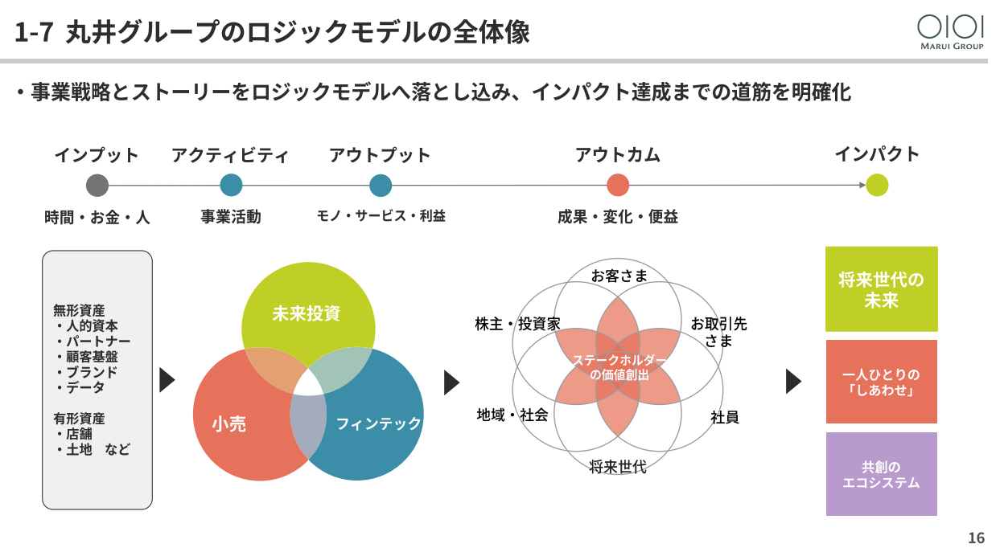
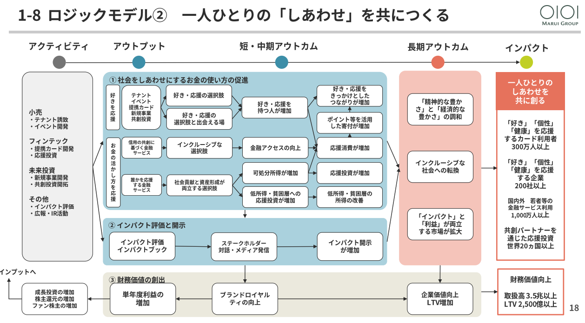
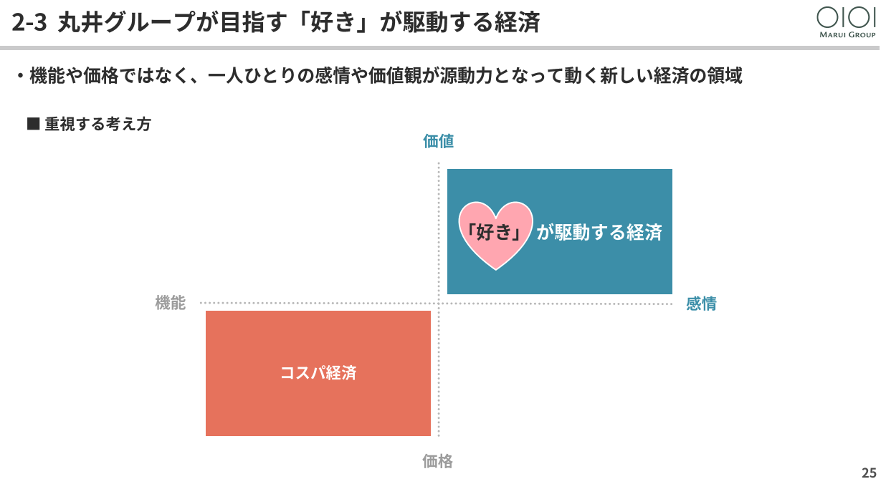
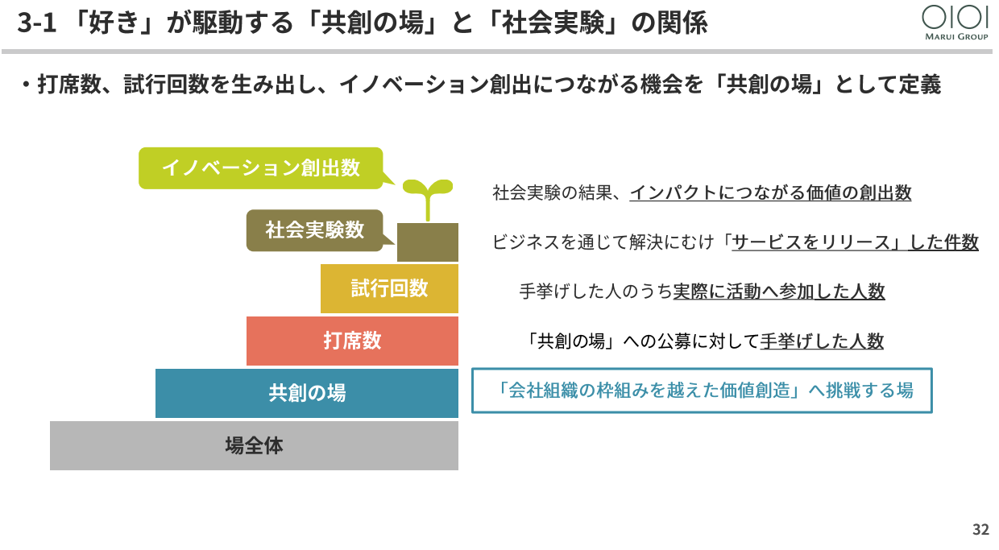
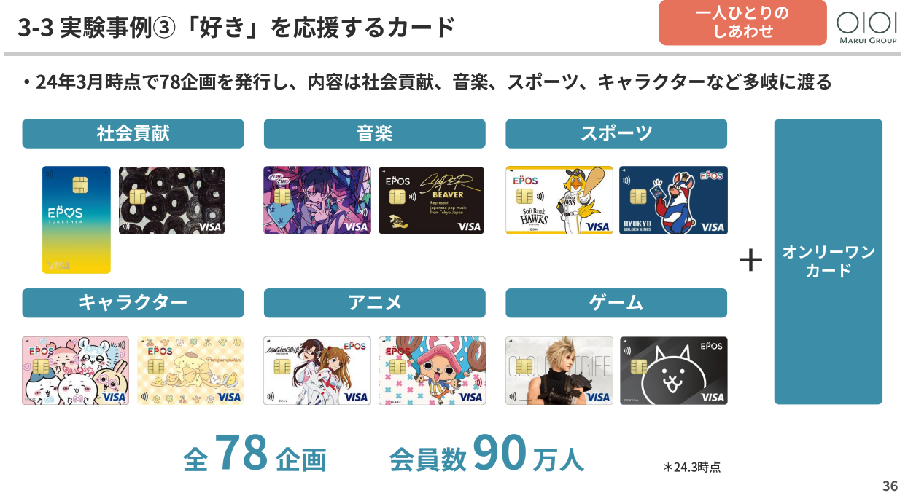
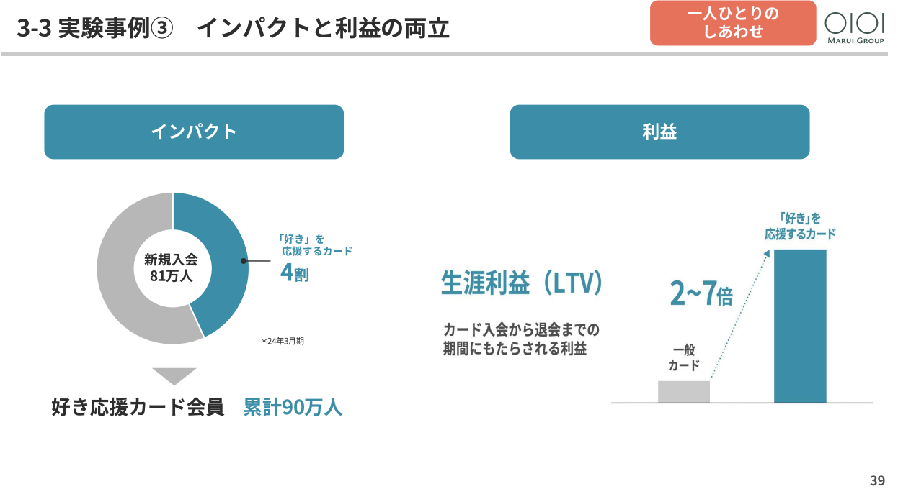
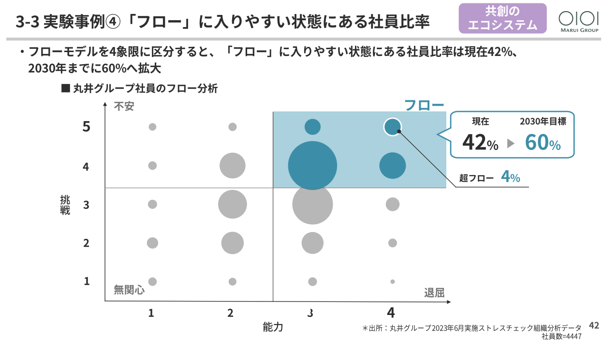
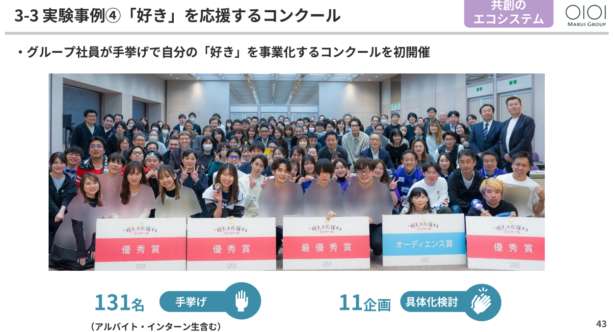
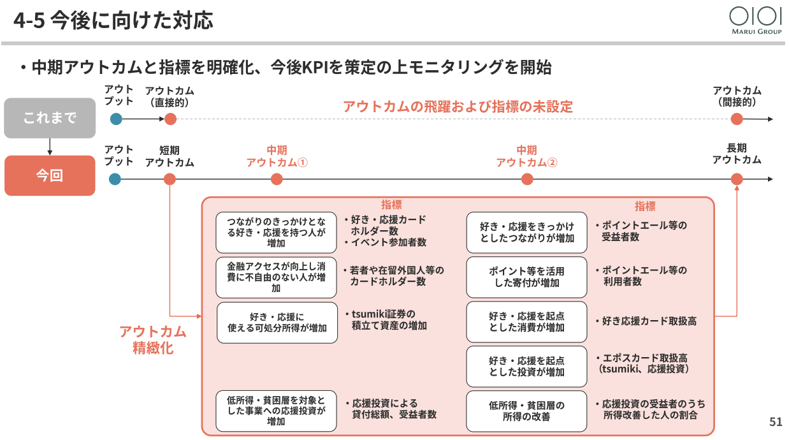
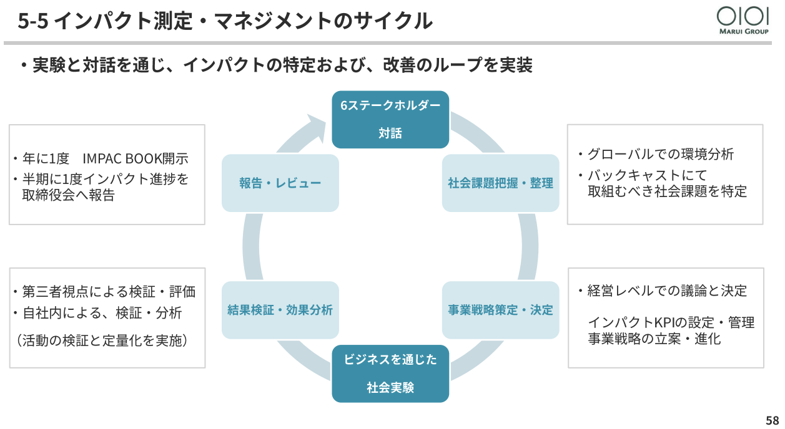

[アジャイルソフトウェア開発宣言](https://agilemanifesto.org/iso/ja/manifesto.html)から既に20年以上が経過し世はすっかりアジャイルの時代。。。と思いきや未だにウォーターフォールが適していないプロジェクトなのにウォーターフォールまっしぐらのチームが多くあることでしょう。

いまさらかもしれないですが、そんなしなくてもいい苦労をしているチームに向けて「なぜアジャイル・Scrumなのか？」ということと「アジャイルとは何か？」ということについていくつかの記事にわけてまとめてみます。

- 1回目： 
- 2回目： 
- 3回目：
- 4回目：


# output(成果物)・outcome(成果)・impact(影響)の区別をつけよう

アジャイルかウォーターフォールかという話をするとき、大きな違いが目指すものが「output(成果物)」なのか、「outcome(成果)」なのかというものがあります。
まずはこの違い及び「impact(影響)」のことも知っておきたいところです。

ここでは3者の違いを、主に[エビデンスベースドマネジメントガイド（EBM）](https://www.scrum.org/resources/evidence-based-management-guide?ref=ServantWorksInc)から紹介します。EBMは、Scrum.orgが提唱しているもので、不確実な状況下で価値提供していくためのガイドのことです。

## output（成果物）

```
 組織が作成するものを指す。例えば、プロダクトのリリース（機能を含む）、レポート、欠陥レポート、
 プロダクトレビュー結果などが挙げられる。

 エビデンスベースドマネジメントガイド（EBM）より
```

これは単純に「作ったもの」になります。

## outcome（成果）

```
プロダクトの顧客またはユーザーが体験する望ましい成果のことを指す。
これらは、顧客またはユーザーが以前は達成できなかった新しい能力
または改善された能力を表している。
例えば、以前よりも速く目的地に行けるようになったり、
以前より稼げたり節約できたりすることが挙げられる。
また、顧客またはユーザーが体験する価値が以前の体験より低下した場合は、
アウトカムがマイナスになることもある。
例えば、これまで利用していたサービスが利用できなくなった場合などである。

エビデンスベースドマネジメントガイド（EBM）より
```

顧客の抱えている問題をどう解決したか？解決したときに、ユーザー・人々の行動がどう変わるか？になります。
基本的にはこの後説明するimpactの指標よりも先行して数値に現れるため、outcomeを計測する指標は先行指標と言われます。

たとえばカスタマージャーニーで表現できるもの、海賊指標（AARRR）やメトリクスマウンテンなどで計測できるものになります。

これらについての詳細は[LEAN UX ―アジャイルなチームによるプロダクト開発](https://www.oreilly.co.jp/books/9784873119984/)が詳しいです。

また、翻訳はされていないのですが、[Who Does What By How Much?: A Practical Guide to Customer-Centric OKRs](https://www.amazon.co.jp/dp/B0CYDH8R71/)では、「誰が」「何をする」「どれだけ」で表現しています。たとえば、

```
新規の企業顧客が購入契約を締結してから30日以内に完全にオンボーディングされ、
製品を使用している

(「Who Does What By How Much?: 
A Practical Guide to Customer-Centric OKRs」より)
```

のような感じです。

## impact(影響)

```
プロダクトの顧客またはユーザーが望むアウトカムを達成したときに、
組織または顧客以外のステークホルダー（投資家など）が達成する結果を指す。
例えば、収益や利益の増加、市場占有率の向上、株価の上昇などが挙げられる。
プラスのインパクトは、顧客がアウトカムの向上を体験した場合にのみ持続的に達成可能である。

エビデンスベースドマネジメントガイド（EBM）より
```

たとえば、収益、売上原価、顧客満足度などが相当します。これらは、ビジネスの健全性を測定することには役に立ちますが、機能レベルの開発チームにとっては、これより低いレベルの指標をもとに作業に取り組む必要があります。また、impactは顧客が使って、評価してお金を払ってもらって初めて分かる、つまり遅延評価の指標になります。


# ウォーターフォールはoutputからimpactを目指す、アジャイルはoutcomeからimpactを目指す

ここで、ウォーターフォールとアジャイルを比較します。

ウォーターフォールは基本「作り切るため」、「output」するためのものです。

作った後・リリース後には成果も測定して改善しているよと思うかもしれませんが、それは「作ったあと」、プロジェクトが終わったあとのことです。

この方法では、作ってリリースするまで顧客に使ってもらえるかがわからない。だから早く計画通りに作らなくてはならないということが起こります。

逆にアジャイルは「outcome」を目指す。そして、outcomeが達成できることを知るにはすべてを作り切る必要がないのです。MVPとかプロトタイプなどソフトウェアがなくてもできるかもしれない。

今目指しているのは、ユーザー・人々のどういう行動の変化か？それをどう認識するか？次はどうするか？プロダクトの初期の初期からプロダクトが続く限りつづきます。

この積み重ねでimpactを目指します。

つくるものが成功するかどうかはデリバリーして使ってもらうまでわかりません。つまり「仮説」です。仮説を検証するのに作りきるまで待つのはあまり良いやり方ではないです。
アジャイルでは、「仮説」を証明するだけのoutcomeを測定し、その結果方向転換しながら進めることができます。

以下は[アジャイルソフトウェア開発宣言の背後にある原則](https://agilemanifesto.org/iso/ja/principles.html)にある一説です。

`価値のあるソフトウェアを早く継続的に提供します。`

`変化を味方につけることによって、お客様の競争力を引き上げます。`

`ビジネス側の人と開発者は、プロジェクトを通して日々一緒に働かなければなりません。`

などがこのことを表しています。

また、早く計画通りに作るといったものとは違うアプローチ、つまりは作ることが目的となっていないため、チームをつくる時間もつくれます（というか必要です）。

ウォーターフォールもアジャイルもどちらも最終的にはimpactを目指すのですが、その過程が全然違うことを理解する必要があるでしょう。

なので、アジャイルに開発している手法を取っているのに、impactの指標しか見ていない、目的としていないのは非常に危険です。つくるためのアジャイルになっていないか確認が必要ですね。

# ビルドトラップ

outputにしか目がいっていないと、ビルドトラップに陥る可能性があります。

機能の開発とリリースに集中してしまっていると、いつのまにか顧客にとっての価値を提供できていない状況に陥ることがあります。

作ったのに使われない。これをビルドトラップといいます。

詳しくは[プロダクトマネジメント ―ビルドトラップを避け顧客に価値を届ける](https://www.amazon.co.jp/dp/4873119251)を読むといいです。

# ダークパターン

逆にimpactにしか目がいっていないと[ダークパターン](https://darkpatterns.jp/types-of-dark-pattern/)のようなものを実装してしまう可能性があります。

たとえば、顧客の同意なしにショッピングカートに商品を追加したり、キャンセル・退会を難しくしたりなどです。

# アジャイルでは途中で撤退も選択肢に入る。ウォーターフォールは作りきるまで撤退できない

ビジネス上の撤退ラインを定めていることも多いと思います。ここにもウォーターフォールとアジャイルで戦略が異なります。

ウォーターフォールは作り終えて、リリースされるまで成功するかどうかがわかりません。そして撤退ラインは基本impactに対して設定されます。

なので、撤退の際はリリースまでのoutputに費やした分の稼働はほとんど無駄ということになってしまいます。

アジャイルの場合はoutcomeを測定するので、どう実験しても成果が出なければその時点で撤退することが可能になります。

# 丸井の事例

プロダクトより広く経営視点の事例にはなりますが、丸井さんではこのoutput/outcome/impactをしっかり踏まえた戦略を取られていて外部向けにも発表しているので紹介します。

[丸井IMPACT BOOK 2024](https://www.0101maruigroup.co.jp/ir/lib/impactbook.html)

※　以下の画像は全て丸井IMPACT BOOK 2024から抜粋したものです。


目指すインパクトの中から「一人ひとりの「しあわせ」」から抜粋していきます。

このように「一人ひとりの「しあわせ」」のインパクトを目指すための短・中・長のアウトカムを定めていっています。ここから「好きを応援」を抜粋していきます。




このようにoutcomeを実現するためにoutputである「好きで応援カード」を実現し、impactまでつなげ、最終的に利益を追求しています。


ここで言うフローとはチャレンジｘ能力、ワークエンゲージメントを指しているそうです。「手挙げ」を推奨し、提案をしてもらうなど「心理的安全性」を高める動きもされています。

outcomeは測定可能です。どの指標を測定するのかも定められています。

実験と対話を重視し、改善のループをしていく。まさしく「アジャイル」ですね。


次回は、これまでの内容を踏まえて、チームの構成のあり方を考えます。
