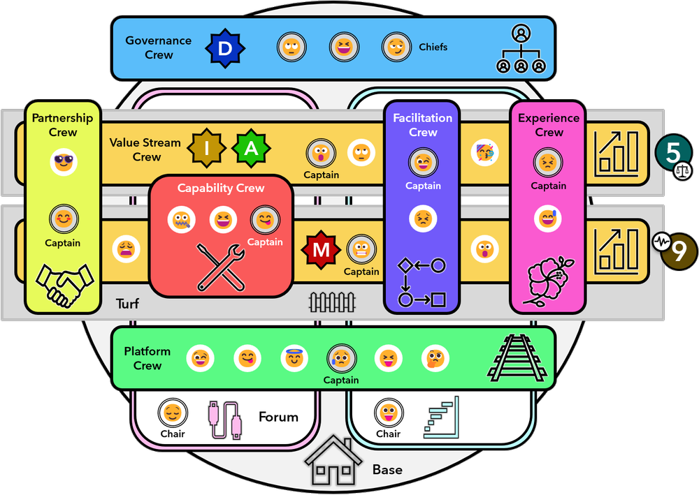

[アジャイルソフトウェア開発宣言](https://agilemanifesto.org/iso/ja/manifesto.html)から既に20年以上が経過し世はすっかりアジャイルの時代。。。と思いきや未だにウォーターフォールが適していないプロジェクトなのにウォーターフォールまっしぐらのチームが多くあることでしょう。

いまさらかもしれないですが、そんなしなくてもいい苦労をしているチームに向けて「なぜアジャイル・Scrumなのか？」ということと「アジャイルとは何か？」ということについていくつかの記事にわけてまとめてみます。

- 第一回： 
- 第二回： 
- 第三回：
- 第四回：
- 第五回：

# アジャイルに適したチーム構成

第二回では、要求・要件や技術が複雑ならアジャイルを選択すること、
第三回・四回では、複雑性の高い現代においては、複雑な問題に対して、各人で困難を別角度から捉えているため、チーム全体で学習が必要だったり、対話が必要だったり、お互いの考えを可視化したり、心理的安全性が高い必要もあったり、ポジティブである必要があったり、つまりチームをつくる必要があること、
第五回では、顧客の抱えている問題をどう解決したか？解決したときに、ユーザー・人々の行動がどう変わるか？つまり成果をプロダクトの初期の初期から、プロダクトが続く限り考える必要があることを説明してきました。

これらを踏まえ、どういうチーム構成だったら最速で成果を出していける、チームが作れるのか？を考えたいです。

## コンポーネントチーム

コンポーネントチームはiOSチーム、BEチーム、FEチーム、ビジネスチームなどコンポーネントごとに分割されたチームです。それぞれのチームごとに専門の技術者が集まっていて最適化された組織ではあります。

しかし、outcomeを出し続けなければならないチームにとっては、各チームの優先順位が異なることでボトルネックが生じます。

また、大きなプロジェクトが始まれば、各チームに専門分野のタスクが降りて対応します。各チームの作業を共有し、進捗を管理するために伝達を行うためだけのミーティングや分科会が増え、そこにエンジニアが参加することになればチームとしての作業が遅れます。チームごとに依存性が発生すれば待ち状態も発生します。

逆にエンジニアが参加せず、リーダーやマネージャーがミーティングの内容をエンジニアに伝えるやり方だと、齟齬が生じやすい、伝言ゲームになりやすい、目指す成果を理解しないまま開発に進みやすいなどの弊害が生じます。

## クロスファンクショナルチーム

単独のチームでoutcomeを出すことができるような自律したチーム。チームとしてiOS、BE、FE、UX、ビジネスなど必要な全ての技術スタックを持った状態になっていること。

チーム内で全て完結すれば、伝達するためだけのミーティングや分科会、伝達のための膨大な資料も全て不要です。outcomeに集中した会話をチーム内で行えば、また、Scrumで言えば、詳細化するのは数スプリント先までとなるので、開発者も一緒に考えながら、かつ理解を伴った上での作業ができるようになります。

チームとして必要なスキルをもっている状態とは、各メンバーが全ての技術に精通している必要はなく、いわゆるT字型のスキルを持っているのが理想とされます。

BEのスペシャリストだが、iOS/FE/UX/ビジネスのスキルも基礎は知っているという感じです。

第三回で、「複雑性の高い現代においては、複雑な問題に対して、各人で困難を別角度から捉えている」と説明しましたが、共通した知識を多少でも持っていれば各メンバーの見ているものが共有しやすくなるでしょう。

このチームの効果は、機能より顧客にとって何が効果的か？を追求できるように、成果についてチーム内で話すことができるようになることです。つまりアジャイルなチームに合っています。逆に言うとクロスファンクショナルチームがアジャイルなチームになるための条件だったりします。

## Two Pizzas Rule

チームが自律する状態を作れれば、各チームが検証すべき成果を定め、つまり仮説を立てて検証していく作業を進めていくことができます。

この自律して動ける人数というのが、Amazon、AWSでは「Two Pizzas」と表現されています。つまり２枚のピザを分け合えるぐらいの人数が適切ということです。

自分の中では、これ以上多すぎると回らないという解釈をしてきたのですが、これはおそらく少なすぎるのも良くないのではと思っています。

チームとして自律するにはチームで完結できるだけのスキルをチームが有していないといけないですよね。少ない人数だとそれが達成できないと思いました。（もちろん少なくても成り立つならそれにこしたことはないです・・・）

つまり、そのままの意味で２枚のピザを分け合えるぐらいの人数。７〜８人が適した人数だということです。

# チームトポロジー

[チームトポロジー　価値あるソフトウェアをすばやく届ける適応型組織設計](https://www.amazon.co.jp/dp/B09MS8BML8/)では、チームの性格を４つのタイプに分類して整理しています。

- ストリームアラインドチーム・・・直接顧客と関わり、顧客にとっての価値を生み出していくチーム
- イネイブリングチーム・・・ツール・プラクティス・フレームワークなどをストリームアライアンドチームに提供・共有するチーム。
- コンプリケイテッド・サブシステムチーム・・・スペシャリストの知識が必要となるパーツを開発・保守（動画コーデック、数理モデル、リアルタイム取引アルゴリズムetc）するチーム
- プラットフォームチーム・・・下位サービス、ID基盤などを提供するチーム

ストリームアラインドチームは非常にやることが多いチームのため、イネイブリングチーム、コンプリケイテッド・サブシステムチーム、プラットフォームチームが負荷を減らしていくということになります。

エンジニアの成長のためにはどのチームにいるのがいいのか？とか個人的に思わないところがないわけではないのですが、各々のチームが独立して動けそうな分類だろうなと思っています。

チーム同士の関わり方についてや、組織とチーム、アーキテクチャの関係性などについても述べられておりおすすめの書籍です。

# unFIXモデル

あまりまだ詳しくないのですが、チームトポロジーをさらに発展させ、スケールにも対応している[unFIX](https://unfix.com/)というモデルもあります。2022年に登場した概念です。
unFIXではチームトポロジーの４つのチーム（ここではクルーとよんでいます）＋３の７つのクルーを定義しています。

この中にはベンダー、パートナー企業などを含むパートナーシップクルーや、経営陣を含むガバナンスクルーが含まれますので、社内全体を考えることも可能になっています。

unFIXについてはまた多く学んだら詳細を書いてみようと思います。

次回が実質最終回、デザインがソフトウェア領域に入ってきてどうなのか？チームはどう変わるのか？についてです。
