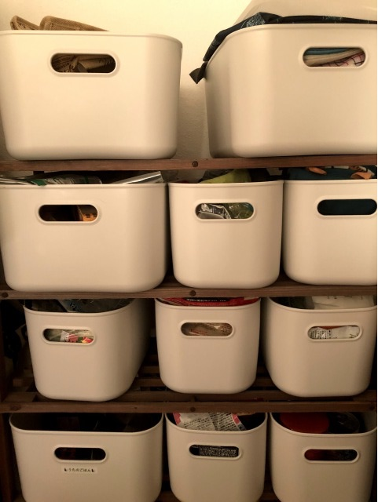
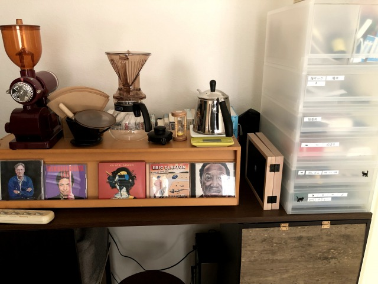
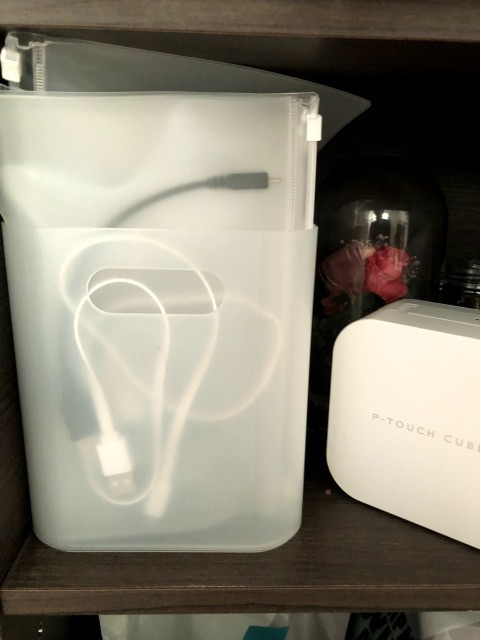
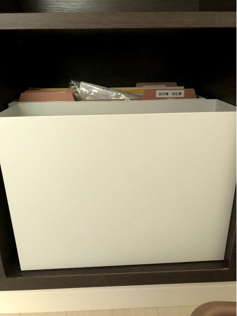

この記事は[無印良品 Advent Calendar 2019](https://adventar.org/calendars/4557) 19日目の記事です。

# 「生活をサボるな」

今年後半の自分のテーマは正にこれでした。[生活とルンバと仕事](https://pilgrim-lifestyle.jp/blog/%E7%94%9F%E6%B4%BB%E3%81%A8%E3%83%AB%E3%83%B3%E3%83%90%E3%81%A8%E4%BB%95%E4%BA%8B/)

生活をきちんとするために、片付けを始めたのですが、そこで無印の出番です！

今年買った無印の収納商品をご覧いただきましょう。

買ったのは展示品の割安だったもので、もうラインナップにない商品です。
小物の収納力が抜群です。

ごちゃごちゃしていたキッチンを整理するために大量に買いました。

ちゃんと揃えると見た目がいいのですが、揃えてから写真とればよかったな・・・

[やわらかポリエチレンケース](https://www.muji.net/store/cmdty/section/S2000414)

右のポリプロピレンケースです。文房具と薬の整理のために買いました。

中は仕切りを付けて結構細かく分類しています。

ポイントは引き出しにシールを貼って、何が入っているかを開けなくても確認できるところ。

日々の片付けにも便利です。

[ポリプロピレンケース](https://www.muji.net/store/cmdty/detail/4548076748991?searchno=12&sectionCode=S200041704)

ごちゃごちゃしたケーブル類の整理のため買いました。

箱はメイクボックスです。
[ポリプロピレンメイクボックス](https://www.muji.net/store/cmdty/section/S02105)

中はEVAケースで小分けしています。
[ＥＶＡケース・ファスナー付](https://www.muji.net/store/cmdty/detail/4550002873592?searchno=12&sectionCode=S107013805)

EVAケースは良品週間のたびに在庫がなくなるので注意です。

説明書などの保管書類の整理のために買いました。

自宅の棚にピッタリ入らずどうしようかと思っていたのですが、縦横逆にしたら超ぴったり。さすが無印です。

[プロプロピレンファイルボックス](https://www.muji.net/store/cmdty/section/S1070103)

来年も、無印で良い生活を・・・