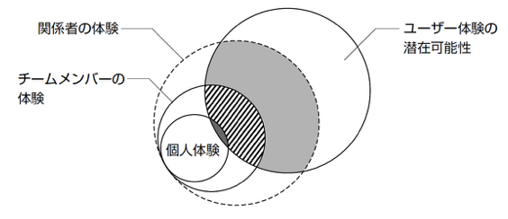

[アジャイルソフトウェア開発宣言](https://agilemanifesto.org/iso/ja/manifesto.html)から既に20年以上が経過し世はすっかりアジャイルの時代。。。と思いきや未だにウォーターフォールが適していないプロジェクトなのにウォーターフォールまっしぐらのチームが多くあることでしょう。

いまさらかもしれないですが、そんなしなくてもいい苦労をしているチームに向けて「なぜアジャイル・Scrumなのか？」ということと「アジャイルとは何か？」ということについていくつかの記事にわけてまとめてみます。

- 第一回： 
- 第二回： 
- 第三回：
- 第四回：
- 第五回：
- 第六回：

# デザインがソフトウェア領域に入ってきてどうなったか？

[LEAN UX](https://www.amazon.co.jp/dp/4873119987)によると、1980〜90年代にデザインがソフトウェア領域に適用されるようになったそうです。当時のアプローチは従来のモノづくり、すなわち「モノ」としてのアウトプットが求められていたやり方（工業デザイン、エディトリアルデザイン、ファッションデザイン）と同様のアプローチでした。デザイナーは作業を始める前に何を作るかをすべて定義しなくてはなりませんでした。

その後、インタラクションデザインや情報アーキテクチャなどのソフトウェア独自の領域が生まれましたが、アプローチとしては以前同様のものでした。

今日では、[第二回](/blog/014_技術と要件からなぜアジャイルなのかを考える/)のとおりソフトウェアは継続してリリースできるようになり、ソフトウェアの適用分野も拡大していきました。ソフトウェアをつくることは簡単になり参入障壁も下がりました。

結果、早期に頻繁にリリースし、マーケットからのフィードバックを得て、学習したことに基づいてイテレーションを繰り返し、ユーザーとの継続的な対話を実現しています。サービスを「提供」しながら「発見」しています。アジャイルな開発です。

こうした中でデザインも作業を始める前に何を作るかをすべて定義する従来のアプローチでは立ち行かなくなりました。

そこで、LEAN UXやLEAN UXが参考にしているデザイン思考などのアプローチが生まれ、ソフトウェアのUXデザインだけでなく、ビジネスプロブレムの発見やビジネスの成果の考慮などもデザインのプロセスの一部として認識されるようになりました。プロダクトデザインの領域です。

作業を始める前に何を作るかをすべて定義できないこと、そして、ユーザーとの継続的な対話の中で、問題を定義し、発想し、MVPや仮説を立て、プロトタイプを作りテストをするプロセス全体がデザインに必要になったということです。

このプロセスの中で、LEAN UXキャンパスやビジネスモデルキャンパス、カスタマージャーニーマップなど整理するための手法も生まれ活用されています。これもデザインの一部として捉えられるかもしれません。

# アウトサイドインとインサイドアウト

デザイン思考を批判しているものの中には（例えば、[なぜデザイン思考はゴミみたいなアイデアを量産してしまうのか](https://note.com/studies_ceo/n/nd3c499f24052)）、デザイン思考はユーザーの中に答えを求めているが、もはやユーザーの中に答えが無い場合がある。１→１００には向くが、０→１には向かないと主張されています。

自分はデザイン思考の歴史については詳しくはないですが、おそらくなんでもかんでもデザイン思考という時代があったのではないかと推測しています。オブジェクト指向のデザインパターンとか、アジャイルでもなんでもかんでも適用するといった風潮がかつてあったかと。

LEAN UXやデザイン思考はつまり、ユーザーの行動や、インタビュー、アンケートなど基本外部要因から企画されるものでした。これらは **「アウトサイドイン」** のアプローチと言えます。

[エンジニアのためのデザイン思考入門](https://www.amazon.co.jp/dp/4798153850)では、「クリティカルデザイン」([クリティカル・デザインとはなにか? 問いと物語を構築するためのデザイン理論入門](https://www.amazon.co.jp/dp/4802511582/))といった他のアプローチが紹介されています。デザイン思考はプロセスが重視されますが、クリティカルデザインはコンセプトを重視しています。
欧米中心に20世紀後半から出てきた、「デザインは従来の機能的で問題解決するものから、もっと思考的で挑発的なものであってよいはずだ」「どれだけ自分の持った疑問を社会に提示して、人を挑発し刺激することができるのかということが重視する」という動きから出てきた思考だそうです。

[スペキュラティヴ・デザイン](https://www.amazon.co.jp/dp/4802510020/)や[意味論的転回](https://www.amazon.co.jp/dp/4434130331/)など近い考え方のデザイン手法もあります（この辺積読中。。。）

これらのアプローチは、ユーザーや社会の行動変容を求めるために企画され、我々が本当にやりたいことする **「インサイドアウト」** のアプローチと言えます。

**「アウトサイドイン」** のアプローチで、ユーザーの離脱を防ぐ（ただし新規獲得が難しい場合がある）、**「インサイドアウト」** のアプローチで、新規ユーザーの獲得（ただし、ユーザーの離脱が発生する場合がある）と、今のプロダクトの状況によって使い分けるといいかもしれません。

# VISIONとMISSION

アウトサイドインのアプローチでは顧客、ユーザーが拠り所となりますが、インサイドアウトのアプローチをプロダクトで適用するにあたっては拠り所がありません。とはいえ、なんでもぶっ飛んだものを作ればいいわけでもありません。

そこで、プロダクトのVISIONやMISSIONが必要となります。

アウトサイドインでは「ユーザーリサーチの結果◯◯と言える」というアプローチですが、インサイドアウトでは「XXというVISIONを実現するために◯◯というMISSIONを目指し▲▲をデザインする」というアプローチになります。

よくプロダクトにはVISIONとMISSIONが必要だと言われますが、理由でこういうことです。チームメンバーは常にVISION・MISSIONを意識しながらプロダクトを進めていく必要があります。

# ビジネス、デザイン、エンジニアリングの堺がなくなりつつある。T字型人材の重要性。

ここまで見てくると、もうビジネスとデザイン、エンジニアリングの堺がなくなりつつあるのがわかります。境がなくなりつつあるなかでチームが分かれていると伝達コスト、伝言ゲーム、誤った解釈など弊害が起こりやすくなります。

また、デザイン思考では多様性のあるチームが求められます。

([エンジニアのためのデザイン思考入門](https://www.amazon.co.jp/dp/4798153850)から)

デザインする人がユーザーと重ならない場合、ユーザー体験は一個人の経験と共通する部分が限られます。チームが多様性を持ったものであれば、チームメンバー関係者の体験がユーザー体験と共通する部分が多くなり、結果ユーザーに喜ばれるものが作れる可能性も高まります。
チーム内であれば濃密にコミュニケーションできるので、他のメンバーがピンとこない場合でも、ユーザーと共通する部分を多く感じている人が熱心にチームメンバーに伝えれば、他メンバーも共感できる部分を捉え直すことができるかもしれません。

チームが必要な理由がここにもありました。

そして、求められる人材はビジネス、デザイン、エンジニアリングどれか専門性を持ちつつも（T字の横）、うっすらとビジネス、デザイン、エンジニアリングの専門外分野を知っている、学習している人材(T字の縦)です。そしてチーム全体としてビジネス、デザイン、エンジニアリングが揃っているとチームとして自律しているかつ、多様性があるチームと言えるでしょう。

# 全体のまとめ

「なぜアジャイルなのか？」「アジャイルとはなにか？」という問いに対する考察は以上になります。
まとめると、
- 要求・要件が複雑化している、技術も複雑化している。要求・要件をもとに実装するのがソフトウェアなので、それらの複雑度でプロセスを選ぶ（1,2回目）
- 複雑化した時代にチームに襲いかかる困難は個人では解決できない。チームを作ることが必要。アジャイルはこれを前提としている。(3回目)
- 群盲像を評す状態からメンバーの景色を見るには学習・対話・心理的安全性といった「チームを作る」といったことが必要で、Management3.0はそれらに対処する手段として有効(4回目)
- アジャイルはoutcome(成果)からimpact(影響・売上)を目指す手法、従前の手法はoutput(成果物)からimpactを目指していた（５回目）
- outcomeを継続的に出し続けるためにはチームが自律して全部できると好都合。クロスファンクショナルチームが有効(6回目)
- デザインもアジャイルの領域に入ってきて、ビジネス、デザイン、エンジニアリングの堺がなくなりつつある。T字型人材の重要性が高まっている(今回)

さて、これらを全部実現しようとすると、組織ごと変えなければいけないことに気がつくでしょう。トップダウンでできれば苦労なく、こんなブログもいらないのですが、そうはいかないことのほうが多いでしょう。

どのように組織を変えていけるのか？が次回最後の課題になります。