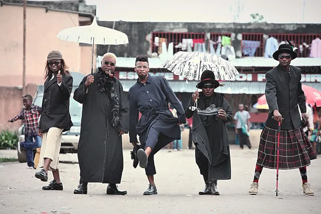

(画像引用：https://tabi-labo.com/284144/sapeur)

この記事は[アラタナアドベントカレンダー2019](https://qiita.com/advent-calendar/2019/aratana)最終日の記事です。

最終日らしいテーマを選びました。

自分は[株式会社アラタナ](https://www.aratana.jp/)に所属して４年になります。

来年の４月には[ZOZO/ZOZOテクノロジーズに再編が決まっています。](https://www.fashionsnap.com/article/2019-12-13/zozo-aratana/)

自分が入社したときには既にZOZO傘下にいましたので、ずっとアパレルのお仕事をしてきたわけですが、アラタナはZOZO傘下に入る前は[カゴラボ](https://eczine.jp/article/detail/5856)というECサイト構築をメインにやってきましたので、途中で参加した自分もやはりどこか「EC」全般というドメインでやっている感覚がどこかにありました。

ここで、ZOZOに編入とのことであらためて「ファッション」「アパレル」「アパレルブランド」という分野にコミットしていく必要があるんだなと再認識しているところです。

すごく恥ずかしい話なのですが、今年40を過ぎて初めて服装をきちんとしようと思いました。

なかなかエンジニアって服装に気を使わない人が多いですよね。ご多分にもれず自分もそのうちの一人でした。

今年になって、[家を整理したり、生活をきちんとしよう](https://pilgrim-lifestyle.jp/blog/%E7%94%9F%E6%B4%BB%E3%81%A8%E3%83%AB%E3%83%B3%E3%83%90%E3%81%A8%E4%BB%95%E4%BA%8B/)と思った過程で、服装にも気を使おうと思ったのです。

ただ、「衣・食・住」と言われるぐらい生きるために必要な服なのですが、いざきちんとしようとするとどうすればいいのか全くわからず。。。男のおしゃれってどうすればいいんですかね。とりあえず、エンジニアらしくググったり、本を漁ったりして勉強しました。

何しろ、全くファッションの用語がわからない。

上下セットのことを「セットアップ」。細く足の形にピッタリするパンツを「スキニー」、足元に向かって細くなってくパンツを「デーパード」。革靴にも種類があって、靴紐のところの形状で「内羽根」「外羽根」でわかれること。つま先に一本線が入ってる「ストレートチップ」。なにもない「プレーントゥ」。U字型になってる「Uチップ」など。。。「ユニクロ」と「ZARA」などの量販店とユナイテッドアローズなどの「セレクトショップ」、「デザイナーズブランド」などはどう違うのか。。。などなど、普通にファッションを楽しんでいる人にとっては常識なことも初めて知りました。

こういうこと知って、実際、実店舗やネットで服や靴を買うと、毎日のコーディネートが少し楽しくなってきました。

気がついたこともあります。
それはアパレルECサイトにとって、最も大事なのは ***「検索」*** と ***「写真」*** であること。

人が服を探すときにはいろんな検索軸があるのだと再認識しました。
例えば、自分は足のサイズがとても小さくなかなか靴のサイズがないです。なのでサイズの検索軸は必須。でも標準の足の方でしたらこれは不要でしょう。

おしゃれな人はつま先の形状で検索したいでしょうが、そうでもない人は値段かもしれません。

人によって検索したい軸が違うのはとても大変だと思いました。これはECサイトの運営側から見れば、自分のブランドのターゲットがどういう人なのかがしっかりしていないと売上に影響するということですね。
構築するシステム側もそれを認識していなければいけないです。

そして、「写真」。写真というのはとても難しい。
目で見る色と写真で撮った色を合わせるって意外と難しい。まあ、プロが撮っているのだからあまり問題じゃないと思いますが、、、問題なのは欲しい角度の写真がないこと。
靴であれば底の写真だったり、コートだったら厚みだったり。。。そういうのがない商品も多く購買率につながるところなのかなぁと思ったり。

と、アパレルECに携わるのであればシステムの人も服装に気を使うって意外と大事なんだなぁと思ったここ最近でした。

さらにそれはそのまま ***ドメイン駆動設計*** と絡めれてしかるべきで、ブランドのターゲットに合わせ、どうドメインを構築していくかに関わってくるはずで、その話ができなければなかなかよいサイトを構築していくのは難しいと思います。

ということで、年の瀬にaranata、ZOZO、IT技術を絡めて話をしてみましたが、最後に、、、今年、ZOZOにとって最大のニュースといえば、前澤さんが退任したことかと思います。
一度しかお会いしたことはないのですが、前澤さんの話で一番印象に残っていることを(実際は前澤さんの話を聞いたaratana社長濱渦さんが話していた話ですが・・・)。

世界一オシャレな人たちってどこにいるか知っていますか？

パリ？イタリア？いいえ、世界一オシャレな人たちは「コンゴ」にいるそうです。

***サプール***という人たちです。

(画像引用：https://tabi-labo.com/284144/sapeur)

コンゴはずっと内戦を繰り返してきた国で、世界でも最も貧しい国の1つです。
それでも彼らは収入のほとんどを服にかけ、おしゃれをしています。

それは「服が汚れるから戦わない」という「平和主義」の意思表示でもあり、「哲学」であり、「宗教」であり「生き様」であったりするということです。

ファッションにはこのような力がある。前澤さんが兼ねてから「夢は世界平和」と語っていましたが、あながち叶わぬ夢ではないことをサプールの人々が証明しています。

そのためにもっと多くの人がおしゃれになる必要がありますよね。
日本ほど裕福な国って実はそれほどないのに、サプールの話を聞くと裕福なのにおしゃれじゃないってちょっともったいないなぁと思ったりしました。
アパレル業界は落ち目と言われるけど、もっと多くの人がおしゃれになれば、アパレル業界も元気になるでしょう。

服というのは生きるためのただの「衣・食・住」のひとつではないということをZOZOは証明しなければいけない企業で、そこの一員になるのがまた楽しみでもあるのです。

という感じでaratanaアドベントカレンダーを締めたいと思います。

良いお年を。